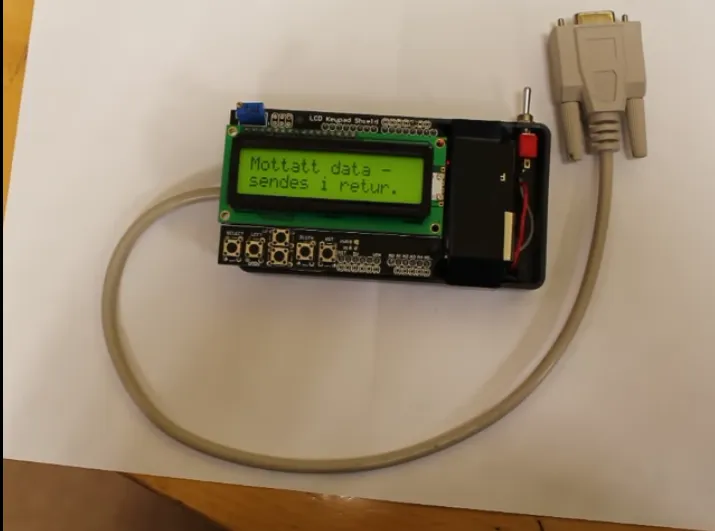

# Handheld RS232 serial data tester

>By Per Emil Skjold.

>Used to diagnose industrial equipment on RS232 serial protocoll.

**HARDWARE:**
- Arduino Uno
- LCD Button shield
- RS232 serial shield (see connection)

**LIBRARY:**
- LiquidCrystal https://github.com/arduino-libraries/LiquidCrystal

**LCD:**
- 2x16 character lcd display.
- Serial Data prints on line 1. Menu prints on line 2.

**MENUS:**
- Menu 1 = Baud rate
- Menu 2 = Send counter on/off
- Menu 3 = Send Preset string
- Menu 4 = Record on/off
- Menu 5 = playback
- Menu 6 = Display non chars on/off
- Menu 7 = RX bytes counter (bytes received)

**CONNECTION:**
- RX PIN 0, TX PIN 1.

**HOMEPAGE:**
- https://skjolddisplay.com/projects/handheld-rs232-serial-data-tester/
- https://www.youtube.com/watch?time_continue=13&v=vVRO6BWD5QU

**HISTORY:**
- v15 Added menu: 'Display non chars'. (Non chars is bytes below Dec32).
  Added menu: 'RX bytes: 0'.
- v16 Key press retrig avoided.
